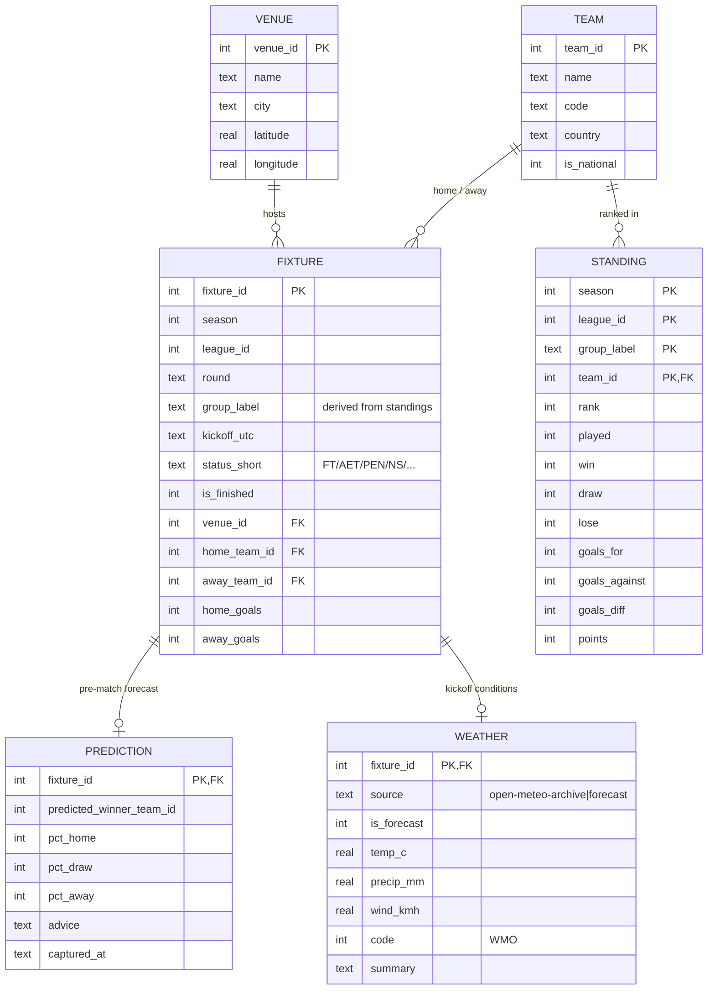

# World Cup 2026 — Data Pipeline

A small, reliable pipeline that ingests **finished** 2026 FIFA World Cup matches
from [API-Football](https://www.api-football.com/) once daily (plus a manual
trigger), stores them in SQLite with strong integrity, and powers Python
notebook reports — starting with a per-group breakdown.

> A static **[Visual Guide](world-cup-2026.html)** to the tournament also lives
> in this repo (`index.html` / `world-cup-2026.html`).

## What it does

- Pulls fixtures, standings, and pre-match predictions for `league=1`, `season=2026`
- Adds per-venue weather from [Open-Meteo](https://open-meteo.com/) (free, no key)
- Stores everything in `data/worldcup.db` with enforced primary/foreign keys —
  **no duplicates, no orphans**, every run idempotent
- Runs daily via GitHub Actions and commits the refreshed database
- Renders a 4×3 small-multiples group report (`reports/01_group_breakdown.ipynb`)

## Data model

SQLite (`data/worldcup.db`). Integrity is structural — `PRAGMA foreign_keys=ON`,
every FK enforced, parents loaded before children, all writes idempotent upserts.
`predictions` are immutable once captured (the pre-match projection is preserved
for prediction-vs-actual analysis).



| Table | Grain | Key columns | Notes |
|---|---|---|---|
| `team` | one national team | `team_id` | the 48 nations |
| `venue` | one stadium | `venue_id` | id assigned from `venues_geo.csv`; lat/long for weather |
| `fixture` | one match | `fixture_id` | `group_label` derived from `standing`; `is_finished` per the PT cutoff rule |
| `standing` | a team's row in a group table | `(season, league_id, group_label, team_id)` | overwritten each run |
| `prediction` | pre-match forecast | `fixture_id` | **immutable** once stored |
| `weather` | kickoff conditions | `fixture_id` | archive for past, forecast for upcoming |
| `load_run` | one ingest run | `run_id` | audit / watermark (calls used, counts, status) |

## Repository layout

```
.github/workflows/daily_ingest.yml   # cron + manual dispatch
src/
  config.py                          # league/season, cutoff TZ, caps, key resolver
  apifootball.py                     # API-Football client (M2)
  openmeteo.py                       # weather client (M4)
  db.py                              # schema + upserts (M1)
  ingest.py                          # backfill + incremental CLI (M3)
  transform.py                       # group assignment, validation (M3)
  integrity.py                       # dup/orphan/reconciliation checks (M1)
data/
  worldcup.db                        # committed SQLite artifact
  venues_geo.csv                     # 16 venue lat/long lookup (M1)
reports/01_group_breakdown.ipynb     # group report (M6)
docs/                                # spec + API endpoint guide (source of truth)
tests/                               # pytest: upsert idempotency, orphan detection
```

## Setup

```bash
python3 -m venv .venv && source .venv/bin/activate
pip install -r requirements.txt
```

### API key (read from the environment only)

The API-Football key is **never stored in this repo**. It lives in a central
`.env` outside the project tree. `src/config.py` resolves it in this order:

1. `APISPORTS_KEY` already in the environment (GitHub Actions secret, or an
   exported shell var) — used as-is.
2. Otherwise the central `.env` is loaded. Path: `WC2026_ENV_FILE` if set, else
   the default `~/.world-cup-2026/.env`.
3. Missing/empty → a clear error naming the path (the value is never printed).

Central `.env` contents:

```
APISPORTS_KEY=your_key_here
```

In CI, add `APISPORTS_KEY` as a GitHub Actions repository secret.

## Build status

Built milestone-by-milestone (see `CLAUDE.md`). **M0 — scaffold:** complete.
