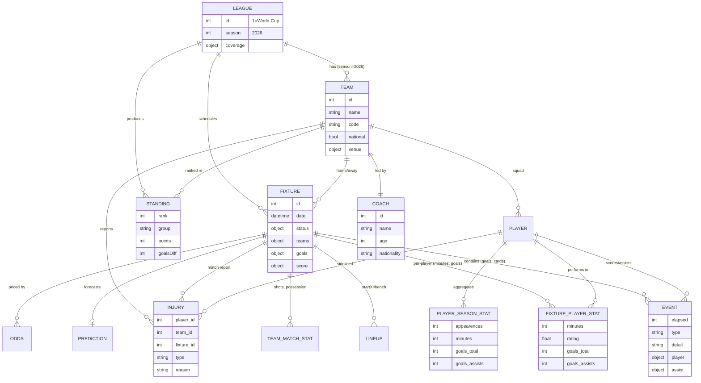

# API-Football (v3) — World Cup 2026 Data Reference

A practical map of the endpoints you need to pull **teams, matches, goals, minutes played, injuries** and related stats for the 2026 FIFA World Cup, plus a data model showing how they join for querying and analysis.

- **Base URL:** `https://v3.football.api-sports.io`
- **Auth header:** `x-apisports-key: YOUR_API_KEY` (use `x-rapidapi-key` if subscribed via RapidAPI)
- **The two keys that drive almost every World Cup call:** `league=1` (FIFA World Cup) and `season=2026`
- **Docs version at time of writing:** v3.9.3 — [full documentation](https://www.api-football.com/documentation-v3)
- **Tournament scope:** 48 teams, 16 stadiums, 104 matches (12 groups of 4 → Round of 32 → R16 → QF → SF → final), June 11–July 19, 2026

Every response follows the same envelope: `get`, `parameters`, `errors`, `results`, `paging`, and a `response[]` array.

---

## 1. Endpoint summary table

Each endpoint links to its section in the official documentation. "Covers" maps the endpoint to the data points you asked about.

| # | Endpoint | Covers | Key parameters | Notable returned fields | Docs link |
|---|----------|--------|----------------|--------------------------|-----------|
| 1 | `GET /leagues` | Competition metadata + **coverage flags** (what data exists for this event) | `id=1`, `season=2026` | `league.id`, `season`, `coverage{fixtures{events,lineups,statistics_fixtures,statistics_players},standings,players,top_scorers,top_assists,top_cards,injuries,predictions,odds}` | [Leagues](https://www.api-football.com/documentation-v3#tag/Leagues) |
| 2 | `GET /teams` | **Teams** (the 48 nations) + home venue | `league=1`, `season=2026`, `id`, `name` | `team{id,name,code,country,founded,national,logo}`, `venue{id,name,city,capacity,surface}` | [Teams](https://www.api-football.com/documentation-v3#tag/Teams) |
| 3 | `GET /teams/statistics` | **Team-level aggregates**: matches, **goals** for/against, clean sheets, form, lineups | `league=1`, `season=2026`, `team` | `fixtures{played,wins,draws,loses}`, `goals{for,against}` (by minute buckets), `clean_sheet`, `lineups`, `cards` | [Teams Statistics](https://www.api-football.com/documentation-v3#tag/Teams) |
| 4 | `GET /standings` | Group tables (all 12 groups) | `league=1`, `season=2026` | `rank`, `group`, `points`, `goalsDiff`, `all{played,win,draw,lose,goals{for,against}}`, `form` | [Standings](https://www.api-football.com/documentation-v3#tag/Standings) |
| 5 | `GET /fixtures` | **Matches** — schedule, live scores, results, **goals** | `league=1`, `season=2026`, `id`, `ids` (≤20, dash-sep), `live=all`, `round`, `status`, `date` | `fixture{id,date,status{short,elapsed},venue}`, `teams{home,away}`, `goals{home,away}`, `score{halftime,fulltime,extratime,penalty}` | [Fixtures](https://www.api-football.com/documentation-v3#tag/Fixtures) |
| 6 | `GET /fixtures/rounds` | Stage/round names + ordering | `league=1`, `season=2026`, `current=true` | array e.g. `"Group Stage - 1"`, `"Round of 32"`, `"Quarter-finals"` | [Fixtures Rounds](https://www.api-football.com/documentation-v3#tag/Fixtures) |
| 7 | `GET /fixtures/events` | In-match events: **goals**, cards, subs, VAR (with **minute**) | `fixture` | `time{elapsed,extra}`, `team`, `player`, `assist`, `type` (Goal/Card/subst), `detail` | [Fixtures Events](https://www.api-football.com/documentation-v3#tag/Fixtures) |
| 8 | `GET /fixtures/lineups` | Starting XI, formation, bench, coach | `fixture`, `team` | `formation`, `startXI[]`, `substitutes[]`, `coach`, player `grid` position | [Fixtures Lineups](https://www.api-football.com/documentation-v3#tag/Fixtures) |
| 9 | `GET /fixtures/statistics` | Per-team match stats | `fixture`, `team` | shots, possession, passes, corners, fouls, offsides, `expected_goals` | [Fixtures Statistics](https://www.api-football.com/documentation-v3#tag/Fixtures) |
| 10 | `GET /fixtures/players` | **Per-player per-match** stats: **minutes played**, **goals**, rating | `fixture`, `team` | `games{minutes,rating,position,captain}`, `goals{total,assists}`, `shots`, `passes`, `tackles`, `duels`, `cards` | [Fixtures Players](https://www.api-football.com/documentation-v3#tag/Fixtures) |
| 11 | `GET /fixtures/headtohead` | Historical meetings between two nations | `h2h=TEAMA-TEAMB`, `last`, `status` | full fixture objects for prior matchups | [Head To Head](https://www.api-football.com/documentation-v3#tag/Fixtures) |
| 12 | `GET /players` | **Player profiles + season-aggregated stats**: **minutes**, **goals**, appearances | `league=1`, `season=2026`, `id`, `team`, `page` | `player{id,name,age,nationality,height,weight,photo}`, `statistics[]{games{appearences,minutes},goals{total,assists},cards}` | [Players](https://www.api-football.com/documentation-v3#tag/Players) |
| 13 | `GET /players/squads` | Tournament squad lists per team | `team`, `player` | `team`, `players[]{id,name,age,number,position}` | [Players Squads](https://www.api-football.com/documentation-v3#tag/Players) |
| 14 | `GET /injuries` | **Injuries & suspensions** (who may miss a match) | `league=1`, `season=2026`, `fixture`, `team`, `player` | `player{id,name}`, `team`, `fixture`, `type` (Missing Fixture / Questionable), `reason` | [Injuries](https://www.api-football.com/documentation-v3#tag/Injuries) |
| 15 | `GET /players/topscorers` | **Goal** leaders | `league=1`, `season=2026` | ranked `players[]` with `goals.total`, `games.minutes` | [Top Scorers](https://www.api-football.com/documentation-v3#tag/Players) |
| 16 | `GET /players/topassists` | Assist leaders | `league=1`, `season=2026` | ranked `players[]` with `goals.assists` | [Top Assists](https://www.api-football.com/documentation-v3#tag/Players) |
| 17 | `GET /players/topyellowcards` / `/topredcards` | Disciplinary leaders | `league=1`, `season=2026` | ranked `players[]` with `cards` | [Top Cards](https://www.api-football.com/documentation-v3#tag/Players) |
| 18 | `GET /coachs` | Coach profiles + career | `team=TEAM_ID`, `id` | `name`, `age`, `nationality`, `team`, `career[]` | [Coachs](https://www.api-football.com/documentation-v3#tag/Coachs) |
| 19 | `GET /venues` | Stadium details (the 16 venues) | `id`, `city`, `country` | `name`, `city`, `country`, `capacity`, `surface`, `image` | [Venues](https://www.api-football.com/documentation-v3#tag/Venues) |
| 20 | `GET /predictions` | Match forecast | `fixture` | predicted winner, score, `percent{home,draw,away}`, form, h2h | [Predictions](https://www.api-football.com/documentation-v3#tag/Predictions) |
| 21 | `GET /odds` (pre-match) / `/odds/live` | Betting odds | `fixture`, `league`, `season` | bookmakers, bet markets, values (pre-match: last 7 days only) | [Odds](https://www.api-football.com/documentation-v3#tag/Odds) |
| 22 | `GET /transfers` | Player transfer history | `player`, `team` | `transfers[]{date,type,teams{in,out}}` | [Transfers](https://www.api-football.com/documentation-v3#tag/Transfers) |
| 23 | `GET /timezone`, `/countries`, `/leagues/seasons` | Reference/lookup data | — | timezone list, country list, season list | [Documentation](https://www.api-football.com/documentation-v3) |

> **Tip — efficiency:** `GET /fixtures?id=FIXTURE_ID` returns four embedded objects in one call (`events`, `lineups`, `statistics`, `players`), so you often don't need the standalone `/fixtures/events|lineups|statistics|players` endpoints. Pass up to 20 fixtures at once via `?ids=ID1-ID2-...`.

### Where each thing you asked about lives

| You want… | Best endpoint(s) |
|-----------|------------------|
| The 48 **teams** | `/teams?league=1&season=2026` |
| All 104 **matches** / schedule / live scores | `/fixtures?league=1&season=2026` (add `live=all`, `round`, `status`) |
| **Goals** — match level | `/fixtures` (`goals`, `score`) and `/fixtures/events` (type=Goal, scorer, minute) |
| **Goals** — player season totals | `/players` (`statistics.goals.total`), `/players/topscorers` |
| **Minutes played** — per match | `/fixtures/players` (`games.minutes`) |
| **Minutes played** — season total | `/players` (`statistics.games.minutes`) |
| **Injuries** / suspensions | `/injuries?league=1&season=2026` (or `?fixture=ID` for a match report) |
| Squads & player profiles | `/players/squads`, `/players` |
| Group standings / bracket | `/standings`, `/fixtures?round=...` + `/fixtures/rounds` |

---

## 2. Data model — how the endpoints join

Everything keys off four identifiers. Capture them once and reuse them:

- **`league` (=1)** + **`season` (=2026)** — scope every query to the World Cup.
- **`team.id`** — links teams ↔ fixtures ↔ players ↔ injuries ↔ coaches ↔ standings.
- **`fixture.id`** — links a match ↔ its events, lineups, statistics, per-player stats, injuries, predictions, odds.
- **`player.id`** — links a player ↔ squad ↔ per-match stats ↔ season stats ↔ injuries ↔ transfers.

```
                 ┌──────────────────────────────┐
                 │  /leagues  (league=1)         │
                 │  coverage flags + season=2026 │
                 └───────────────┬──────────────┘
                                 │ league + season
        ┌────────────────────────┼─────────────────────────┐
        │                        │                          │
        ▼                        ▼                          ▼
┌───────────────┐      ┌──────────────────┐       ┌──────────────────┐
│  /teams       │      │  /standings      │       │  /fixtures        │
│  team.id ◄────┼──────┤  team.id, group  │       │  fixture.id       │
│  + venue      │      │  pts, GF, GA     │       │  teams.home/away  │
└───────┬───────┘      └──────────────────┘       │  goals, score     │
        │ team.id                                   └────────┬─────────┘
        │                                                    │ fixture.id
        ├──────────────┬──────────────┐         ┌────────────┼───────────────┬───────────────┐
        ▼              ▼              ▼         ▼            ▼               ▼               ▼
┌──────────────┐ ┌──────────┐ ┌──────────┐ ┌──────────┐ ┌──────────────┐ ┌────────────┐ ┌────────────┐
│ /players,    │ │ /coachs  │ │/injuries │ │/fixtures │ │ /fixtures    │ │ /fixtures  │ │/predictions│
│ /players/    │ │ team.id  │ │ team.id  │ │ /events  │ │ /players     │ │ /lineups,  │ │ /odds      │
│  squads      │ │          │ │ fixture? │ │ goals,   │ │ minutes,     │ │ /statistics│ │ fixture.id │
│ player.id    │ │          │ │ player.id│ │ cards,   │ │ goals,rating │ │ fixture.id │ │            │
│ goals,minutes│ │          │ │          │ │ minute   │ │ player.id    │ │            │ │            │
└──────┬───────┘ └──────────┘ └──────────┘ └──────────┘ └──────┬───────┘ └────────────┘ └────────────┘
       │ player.id                                              │ player.id
       └───────────────────────── join on player.id ───────────┘
```

### Entity-relationship view (Mermaid)



### Typical analysis joins

- **Team goal-scoring profile:** `/standings` (GF/GA) → drill into `/fixtures` for that team → `/fixtures/events` filtered `type=Goal` for scorers and minutes.
- **Player tournament dashboard:** `/players/squads` (roster) → `/players` (season totals: minutes, goals) → loop `/fixtures/players` across that team's `fixture.id`s for per-match minutes and ratings → cross-reference `/injuries` to flag availability.
- **Availability / matchday prep:** `/fixtures?round=current` → for each `fixture.id` call `/injuries?fixture=ID` and `/predictions?fixture=ID`.
- **"Minutes played" leaderboard:** aggregate `games.minutes` from `/fixtures/players` per `player.id`, or read season totals directly from `/players`.

---

## 3. Practical notes

- **Discover before you build:** call `/leagues?id=1&season=2026` first and read `coverage`. A `true` flag means the data type is supported, though availability can vary match-to-match early in the tournament.
- **Refresh cadence:** `/fixtures` and `/fixtures/events` update every ~15 seconds during live play — cache accordingly. Most other endpoints update a few times per day (≈1 call/hour is plenty).
- **Pagination:** `/players` is paginated (`page=1,2,…`); check `paging.total`.
- **Knockout fixtures** are added automatically once both participating teams are known, so poll `/fixtures/rounds?current=true` to follow the bracket.
- **Status codes** on fixtures (`NS`, `1H`, `HT`, `2H`, `ET`, `P`, `FT`, …) tell you exactly where a match stands; filter live games with `status=1H-HT-2H-ET-P-BT-LIVE` or `live=all`.

---

### Sources

- [API-Football v3 — Full Documentation](https://www.api-football.com/documentation-v3)
- [FIFA World Cup 2026: Guide to Using Data with API-SPORTS](https://www.api-football.com/news/post/fifa-world-cup-2026-guide-to-using-data-with-api-sports)
- [New Endpoint: Injuries](https://www.api-football.com/news/post/new-endpoint-injuries)
- [How to Get Started with API-Football](https://www.api-football.com/news/post/how-to-get-started-with-api-football-the-complete-beginners-guide)
